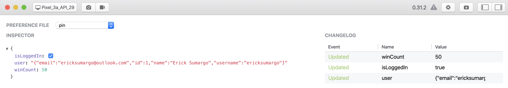
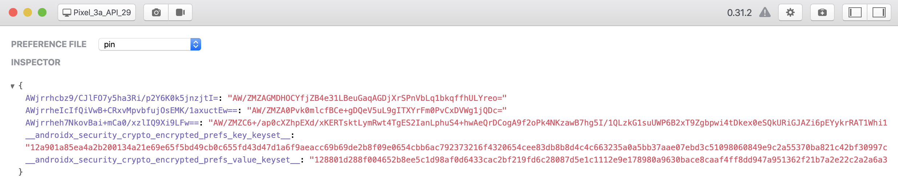

# Pin [  ](https://bintray.com/ericksumargo/Bael/com.bael.pin/1.0/link)
Here's a look how our session data is stored using Android's normal [SharedPreferences](https://developer.android.com/training/data-storage/shared-preferences) API:
<br/>
<br/>

<p align="center">Flipper - Normal/Plain Mode</p>
<br/>

It's plain. With some proper steps, it's easily getting exposed. [[See How-to](https://resources.infosecinstitute.com/android-hacking-security-part-9-insecure-local-storage-shared-preferences/#gref)]
<br/>
<br/>
Thankfully, Android Jetpack's team comes with new [EncryptedSharedPreferences](https://developer.android.com/reference/androidx/security/crypto/EncryptedSharedPreferences) API to support data encryption. 
<br/>
<br/>

<p align="center">Flipper   - Encrypted Mode</p>
<br/>
As normal SharedPreferences, we still need to deal with some tedious boilerplates, e.g., instantiating, mechanism to read, and write a preference. 
<br/>
<br/>
This is the background why <b>Pin</b> comes to surface. Pin helps to abstract away those boilerplates and with additional features so you can 100% just focus on business.
<br/>
<br/>

## Features
Pin provides:
- Encrypted/Normal mode
- Less verbose syntax
- Support complex object and null default value
- Compile time safety

## Download
```groovy
implementation 'com.bael:pin:${latestRelease}'
```

## Setup
Init Pin in the `onCreate` method of your application class
```kotlin
override fun onCreate() {
    super.onCreate()
    // Set useEncryptedMode as false to switch back into normal mode
    Pin.init(context = this, "YOUR_PREFERENCES_FILE_NAME", useEncryptedMode = true)
}
```

## Usage
```kotlin
class MainActivity : AppCompatActivity() {

    // Less Verbose
    private var object1: Int by Pin(key = "object1_key", defaultValue = -1)

    // Support Complex Object
    private var object2: Movie by Pin(key = "object2_key", defaultValue = Movie())

    // Support Nullability
    private var object3: Movie? by Pin(key = "object3_key", defaultValue = null)

    /** 
      * Compile Time Safety
      * Below lint will be error, the type should be declared as nullable since the default set null
      * private var object4: Movie by Pin(key = "object4_key", defaultValue = null)
      */

    override fun onCreate(savedInstanceState: Bundle?) {
        super.onCreate(savedInstanceState)
        setContentView(R.layout.activity_main)

        /**
         * Read
         * 1. Read it like a normal variable
         * 2. Seriously, that's all
         */
        println(object1)
        println(object2)
        println(object3)

        /**
         * Write
         * 1. Update it like normal variable assignment
         * 2. Seriously, that's all
         */
        object1 = 1
        object2 = Movie()
        object3 = null        
    }
    
    override fun onDestroy() {
        // Remove a preference value associated with certain key
        Pin.clear("object1_key")
        // Remove all values from preferences
        Pin.clear()
        
        super.onDestroy()
    }
}
```

# License
```
Copyright 2020 Erick Sumargo

Licensed under the Apache License, Version 2.0 (the "License");
you may not use this file except in compliance with the License.
You may obtain a copy of the License at

   http://www.apache.org/licenses/LICENSE-2.0

Unless required by applicable law or agreed to in writing, software
distributed under the License is distributed on an "AS IS" BASIS,
WITHOUT WARRANTIES OR CONDITIONS OF ANY KIND, either express or implied.
See the License for the specific language governing permissions and
limitations under the License.
```
